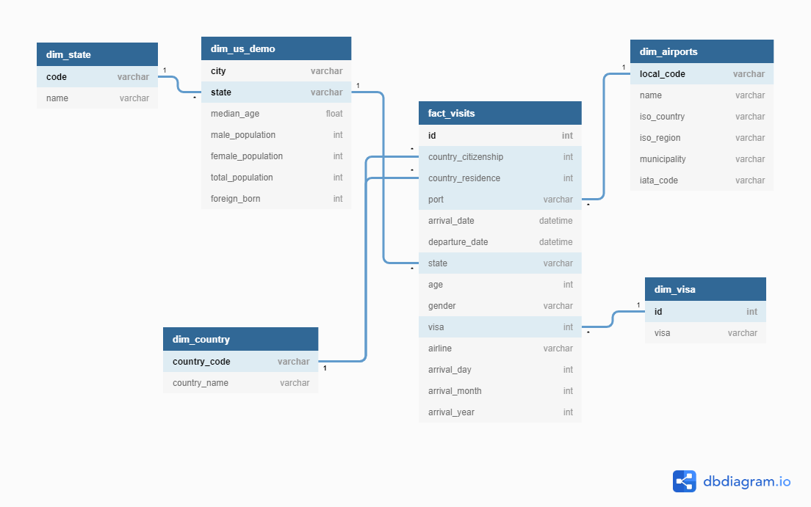

# Capstone Project

In this open-ended project we build a Data Warehouse for the I94 Immigration Data coming from the US National Tourism and Trade Office, and further enrich it with various other datasets such as US City Demographic Data, Airports data, Country and States data, and Visa information.

## Data Sources

* **I94 Immigration Data**: [This](https://travel.trade.gov/research/reports/i94/historical/2016.html) is where the data comes from. There's a sample file so you can take a look at the data in csv format before reading it all in. 
* **U.S. City Demographic Data**: This data comes from OpenSoft. You can read more about it [here](https://public.opendatasoft.com/explore/dataset/us-cities-demographics/export/)
* **Airports Data**: This is a simple table of airport codes and corresponding cities. It comes from [here](https://datahub.io/core/airport-codes#data)
* **Others**: Some other datasets such as Country & State codes, and Visa information have been consolidated in an SAS file included [here](https://github.com/ashu20777/Udacity_Data_Engineering/blob/master/Capstone_Project/data/I94_SAS_Labels_Descriptions.SAS) 

## Data Model

The Data Warehouse has been implemented as a Star Schema, with one fact table FACT_VISITS and multiple dimensions. Below is a screen shot of the Data Model:

## Technologies used

* **Spark**: I used Spark to process the input data because it can handle very large amounts of data with very good performance. Besides, Spark has a SQL library that allows you to query the data using SQL syntax, like you would on a database like MySQL or Oracle.
* **Python**: Python programming language is widely used in Data Engineering because of its effectiveness and simplicity.
* **Juptyer Notebook** was used for development and data analysis using Python.

## Project structure

Below are the file included in this project:

- etl.py: The main Python script. It reads input datasets using Spark, cleans the datasets, transforms and loads fact and dimension tables, and finally runs data quality checks.
- clean.py: This python script cleans input datasets by discarding invalid data, fixing and converting data types and date formats, renaming columns to meaningful names.
- load.py: This python script loads data into fact and dimensions as parquet files after applying the appropriate partitioning.
- validate.py: Runs data validations and data quality checks such as check row counts, unique keys, missing (null) values, etc.
- parse_I94_SAS_labels_descriptions.py: Parses I94_SAS_Labels_Descriptions.SAS file for valid codes and load into Spark data frames.
- Capstone Project Template.ipynb: Jupyter notebook used for development, also contains detailed execution steps, data model and project write up.
- data_dictionary.md: Contains the data dictionary.
- README.md: current file

## How to run

- Run the following command:

	`python etl.py`